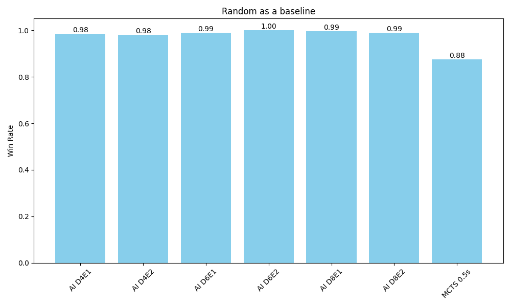
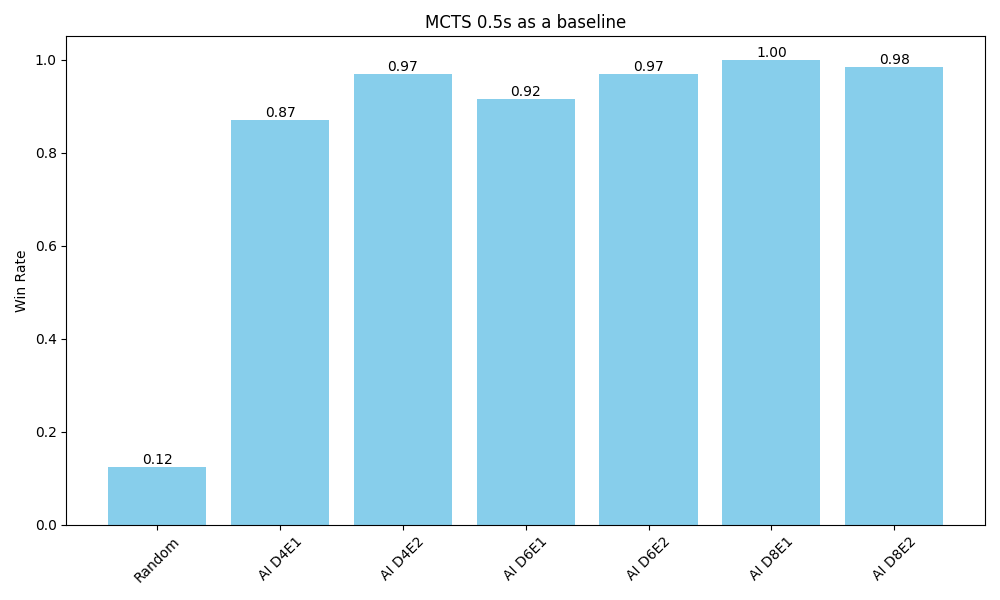
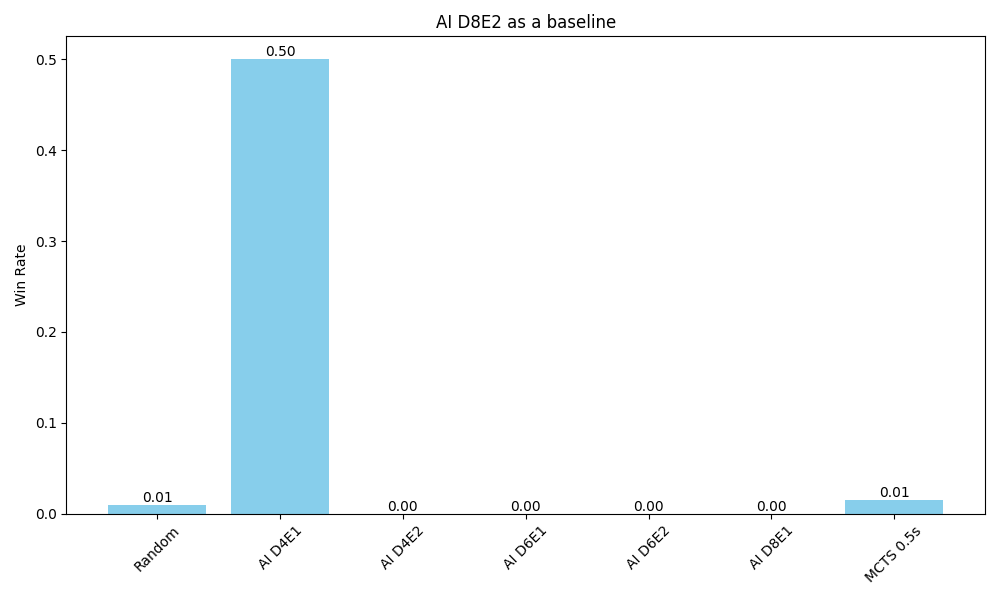

# Introduction

Nine Board Tic-Tac-Toe, also known as Ultimate Tic-Tac-Toe, is a board game composed of nine tic-tac-toe boards arranged in a 3×3 grid. Players take turns playing on the small tic-tac-toe boards until one of them wins on the main board. Compared to traditional tic-tac-toe (xkcd. n.d.), strategy in this game is conceptually more difficult and has proven more challenging for computers.

### Ultimate Tic-Tac-Toe Rules

1. The first move can be placed on any of the 81 empty cells.
2. Subsequent moves are restricted to the board corresponding to the position of the previous move within its local small board.
3. Once a small board is controlled(won) by a player or it is filled completely, no more moves may be played in that board, they may choose any empty space on any available board.
4. Victory is achieved by winning three small boards in a line (row, column, or diagonal) on the main board. (P.S: different from the assignment description, in the assignment, any board is a win.)


### Project Objectives

The primary objectives of this project are:

1. To implement the Nine Board Tic-Tac-Toe game logic in Python.
2. To develop and compare multiple AI agents capable of playing the game effectively, including:
   - Minimax algorithm with complete search (not implemented due to the large search space)
   - Minimax algorithm with alpha-beta pruning and depth-limited search including evaluation functions ~~comparing among different depths, two different evaluation strategies~~
   - Monte Carlo Tree Search (MCTS)
3. To create a random agent as a baseline for performance comparison.
4. To conduct a comprehensive evaluation of these AI agents, analyzing their performance in terms of win rates and computational efficiency.
5. To gain insights into the strengths and weaknesses of different AI approaches in the context of Ultimate Tic-Tac-Toe.

Through this project, we aim to explore the application of classical AI techniques to a complex game.

# Agent Design:
I choose minimax algorithm with alpha-beta pruning, depth-limited search and evaluation function to implement the agent. The reason for not choose minimax with complete search is that it is infeasible to implement for Ultimate Tic-Tac-Toe due to the game's complexity, expecially the branching factor in the early moves, which is too high, and the number of possible game states is too large to explore [TODO: reference to the calculation of the complexity]. And I also choose MCTS method for comparison. For baseline test, I choose random agent. A human agent is also implemented just for fun.

Four kinds of agents:
- Random agent: randomly choose a move from the possible moves.
- Minimax agent: minimax algorithm with alpha-beta pruning.
- MCTS agent: Monte Carlo Tree Search.
- Human agent: input the move in the console. (not included in the evaluation)


### Heuristic Evaluation Function Rules:
Two versions of the evaluation function have been implemented. Although the relatively simple rules of Ultimate Tic-Tac-Toe, the game lacks a straightforward heuristic evaluation function (Ultimate tic-tac-toe. n.d.). The strategies employed for the evaluation functions in this program is listed below:

1. **Small-Board Status**:
   - **Completed Boards**: Prioritize completed sub-boards with a winning configuration. If a small-board is won, it contributes significantly to the overall score.
   - **Potential Wins**: Evaluate small-boards based on potential winning combinations (e.g., two of your symbols in a row with an empty space).

2. **Center Control**:
   - Both on the main 3x3 board and each small-board, control of the center is advantageous. The center is often a strategic point in both traditional and Nine Board Tic-Tac-Toe.

3. **Open Rows, Columns, and Diagonals**:
   - The number of open rows, columns, and diagonals that can potentially lead to a win on each small-board. 


## Implementation:
### The whole structure of the program
The whole program is implemented in Python3, and the diagram shows how these components interact with each other to facilitate a game of Ultimate Tic Tac Toe.


### Data Structure of the Game Board : 
The data structure of the game board is a 9x9 2D array, each sub-array with 9 elements represent a 3x3 small board. Each cell in the small board can be empty, 'X', or 'O'. They are represented by three integer numbers 0, 5, 2 respectively [table 1]. Because using integer number is super efficient to calculate the game result which is assessed by three cell states in a line(row, column or diagonal). For example, for three 'X's in a row, instead of checking each cell equal to 'X', we can directly check the sum of the row is 15. The detail is shown in the [table 2] below:

[table 1]
| Cell State | Value |
| --- | --- |
| 'X' | 5 |
| 'O' | 2 |
| Empty | 0 |


[table 2]
| Sum | Combination |
| --- | --- |
| 15 | three 'X'|
| 6 | three 'O'|
| 12 | two 'X' and one 'O'|
| 9 | two 'O' and one 'X'|
| 10 | two 'X' and one empty|
| 7 | one 'O' and one 'X' and one empty|
| 2 | one 'O' and two empty|
| 5 | one 'X' and two empty|
| 0 | three empty|

It's aslo very efficient to evaluate the value of evaluation functions, because the sum of three cell states in line is unique for each combination used in the evaluation functions.

#### Heuristic Evaluation Function
Based on the heuristic evaluation function rules, I set two versions of evaluation function, which will be used in the minimax algorithm with alpha-beta pruning, called Evaluation Function 1 and Evaluation Function 2.
Evaluation Function 1 uses only the first rule listed above, the status of each small-board, completed and potential winning, shown in [table 3].

[table 3]
| Status of Cells | Small Board Score | Main Board Score |
| --- | --- | --- |
| Three 'X' | 10 | 100 |
| Three 'O' | -10 | -100 |
| Two 'X' and one empty | 5 | 50 |
| Two 'O' and one empty | -5 | -50 |

P.S: Three 'X' in a line for the main board means player X wins three small-boards in a line.

Evaluation Function 2 uses more other two rules to evaluate the board. Center control and Open rows, columns, and diagonals. The detail is shown in [table 4].

[table 4]
| Status of Cells | Small Board Score | Main Board Score |
| --- | --- | --- |
| Three 'X' | 10 | 100 |
| Three 'O' | -10 | -100 |
| Two 'X' and one empty | 5 | 50 |
| Two 'O' and one empty | -5 | -50 |
| One 'X' and two empty | 2 | 20 |
| One 'O' and two empty | -2 | -20 |
| X in the center | 3 | 10 |
| O in the center | -3 | -10 |

#### Multi-processing
using the `multiprocessing` library to run multiple games in parallel, when evaluating the performance of the agents, because each matchup of agents has to play 100 games, if not using multi-processing, it will take too long to run. It will use 10 processes to run the games in parallel, due to the Apple M1 Max, 10 CPU cores.

#### Minimax with alpha-beta pruning
The minimax algorithm with alpha-beta pruning is implemented in the `minimax.py` file. It also combined with depth-limited search and evaluation function listed in the heuristic evaluation function section. The below is the pseudocode of the core part of the algorithm. You can find it used `UNDO-ACTION` instead of copying the game board(`NineBoard`) to generate new board.

```pseudocode
function MAX-VALUE(game_board, depth, α, β, eval_function)
    if IS-TERMINAL(game_board) or depth = 0
        return EVALUATE(game_board, eval_function)
    
    v ← -∞
    for each valid_action in GET-VALID-ACTIONS(game_board)
        new_board ← APPLY-ACTION(game_board, valid_action, X)
        v ← MAX(v, MIN-VALUE(new_board, depth - 1, α, β, eval_function))
        game_board ← UNDO-ACTION(new_board, valid_action)
        α ← MAX(α, v)
        if β ≤ α
            break  // Beta cutoff
    return v

function MIN-VALUE(game_board, depth, α, β, eval_function)
    if IS-TERMINAL(game_board) or depth = 0
        return EVALUATE(game_board, eval_function)
    
    v ← +∞
    for each valid_action in GET-VALID-ACTIONS(game_board)
        new_board ← APPLY-ACTION(game_board, valid_action, O)
        v ← MIN(v, MAX-VALUE(new_board, depth - 1, α, β, eval_function))
        game_board ← UNDO-ACTION(new_board, valid_action)
        β ← MIN(β, v)
        if β ≤ α
            break  // Alpha cutoff
    return v
```

#### MCTS

The MCTS algorithm is implemented in the `mcts.py` file. The below is the pseudocode of the core part of the algorithm. It uses UCB1 formula to select the best child node. The exploration constant `1.4` is used in the UCB1 formula.

```pseudocode
class Node
    state: GameState
    parent: Node
    children: List<Node>
    visits: Integer
    value: Float
    untried_actions: List<Action>

function MCTS-SEARCH(root_state, time_limit)
    root ← NEW Node(state = root_state)
    end_time ← CURRENT-TIME() + time_limit
    
    while CURRENT-TIME() < end_time
        node ← SELECT(root)
        if not IS-TERMINAL(node.state)
            node ← EXPAND(node)
            simulation_result ← SIMULATE(node.state)
        else
            simulation_result ← EVALUATE(node.state)
        BACKPROPAGATE(node, simulation_result)
    
    return BEST-CHILD(root)

function SELECT(node)
    while node.untried_actions is empty and node.children is not empty
        node ← BEST-UCT(node)
    return node

function EXPAND(node)
    action ← REMOVE-RANDOM(node.untried_actions)
    new_state ← APPLY-ACTION(node.state, action)
    child ← NEW Node(state = new_state, parent = node)
    node.children.ADD(child)
    return child

function SIMULATE(state)
    while not IS-TERMINAL(state)
        action ← RANDOM-POLICY(state)
        state ← APPLY-ACTION(state, action)
    return EVALUATE(state)

function BACKPROPAGATE(node, result)
    while node is not null
        node.visits ← node.visits + 1
        node.value ← node.value + result
        node ← node.parent
        result ← -result  // Negate for opponent's perspective
```


## Evaluation

### Experiment Setup
The experiment is conducted in the same environment, Apple M1 Max, 10 CPU cores, 64GB RAM. 100 games for each matchup, each matchup will switch the role of X and O and play another 100 games. The max depth of minimax is set to 8 and the time limit for MCTS is set to 0.5 second, all due to the performance consideration.

There are 8 agents listed below will be evaluated:

| Name | Type | Settings |
| --- | --- | --- |
| Random | Random| - |
| AI D4E1 | Minimax| Depth: 4, Evaluation: 1 |
| AI D4E2 | Minimax | Depth: 4, Evaluation: 2 |
| AI D6E1 | Minimax | Depth: 6, Evaluation: 1 |
| AI D6E2 | Minimax | Depth: 6, Evaluation: 2 |
| AI D8E1 | Minimax | Depth: 8, Evaluation: 1 |
| AI D8E2 | Minimax | Depth: 8, Evaluation: 2 |
| MCTS 0.5s | MCTS | Time limit: 0.5s |


### Results and Analysis
For comparing the performance of each agent, I use the Glicko-2 rating system to evaluate the skill level of each agent (Glickman, 2022). It allows for easy comparison between different AI methods and strategies, clearly showing which approaches are more effective. Initial rating is 1500, and RD is 350, and volatility is 0.06.

The win rate is calculated by the number of games won plus half the number of games drawn divided by the number of games played.

```
win_rate = (wins + 0.5 * draws) / total_games
```

The data shown in [chart 1] is calculated by using Glicko-2 rating system, we can see that AI D8E2 (Minimax with depth 8 and evaluation function 2) has the highest rating at 1856.78, indicating it's the strongest agent overall. MCTS 0.5s has one of the lower ratings (1230.23) among the AI agents, only outperforming the Random agent (1026.48). There's a clear progression in strength as the depth increases for Minimax agents (D4 < D6 < D8) in the same evaluation function. Evaluation function 2 consistently outperforms evaluation function 1 for the same depth, even significantly better than deeper depth Minimax AI, for the case AI D4E2 is way better AI D6E1 with rating 1678.88 and 1525.59 respectively, and AI D6E2 (1717.99) is slightly bit better than AI D8E1 (1712.86). The Random agent has the lowest rating, as expected. (The red dash line at 1500 is the initial rating of each agent)

From [chart 2], we can see that as expected, the computation time increases exponentially with the depth of the Minimax algorithm. AI D8E2 takes the longest time per game at 45.60s, which is consistent with its high performance.  MCTS 0.5s with 13.86s has a consistent time per game, likely due to its fixed time limit. The Random agent has the shortest time per game near to 0s, as it doesn't perform any complex calculations.

The win rate data for [Chart 3] is from others agents as X agianst Random as O in 100 games, and then Random as X against others agents as O in 100 games. From [chart 3], it shows that all AI agents significantly outperform the Random agent, winning close to 100% of their games against it. The performance against the Random agent improves slightly as the Minimax depth increases but not significantly. MCTS 0.5s also performs very well against the Random agent at 0.88.

The win rate data for [Chart 4] is from other agents as X agianst MCTS 0.5s as O in 100 games, and then MCTS 0.5s as X against other agents as O in 100 games. From [chart 4] it shows that the AI agents completely defeated MCTS 0.5s all above 0.9 in the win rates, except AI D4E1 is a little bit lower at 0.87. Random agent is defeated by MCTS 0.5s clearly at 0.12.

The win rate data for [Chart 5] is from other agents vs AI D8E2 and AI D8E2 vs other agents in 100 games respectively. From [chart 5], it shows that AI D8E2 dominates against all other agents at almost 100% win rate, including MCTS 0.5s. It has the highest win rate across all matchups, confirming its top position in the Glicko-2 ratings [Chart 1]. But an unexpected result that the matchup between AI D4E1 and AI D8E2 is 0.5 rate, actually it was draw for every game in the 100 games.
~~, AI D8E2 has deeper search depth and more advance evaluation function, but did not win D4E1 even once.~~

These charts collectively demonstrate the effectiveness of deeper Minimax searches and the clear effectiveness of different evaluation function. They also highlight the trade-off between computational time and performance, with deeper searches generally yielding better results at the cost of longer computation times.

Chart 1: Glicko-2 rating of each player


Chart 2: Average time per game of each player


Chart 3: Baseline test between other players and Random player


Chart 4: baseline test between other players and MCTS 0.5s


Chart 5: Baseline test between other players and AI D8E2


# Discussion
### The strengths and weaknesses of each approach:

1. Minimax with Alpha-Beta Pruning, depth-limited search and evaluation function:

Strengths:
- Consistently strong performance, especially at higher depths
- Improved performance with better evaluation functions
- Deterministic and reliable decision-making

Weaknesses:
- Exponential increase in computation time with depth
- Performance heavily dependent on the quality of the evaluation function
- May struggle in very complex game states due to branch factor and depth limitations

For instance, AI D8E2 is the highest overall performance, demonstrating the effectiveness of deeper search and a more sophisticated evaluation function. Whereas it has the longest computation time, which could be problematic in time-sensitive scenarios. The deeper search depth allows the agent to look further ahead in the game tree, considering more potential future states. This enables it to make more strategic decisions that account for long-term consequences. And it also comes along with an advanced evaluation function (Evaluation Function 2) that allows AI D8E2 to outperform other agents consistently. Evaluation Function 2 consistently outperformed Evaluation Function 1 at the same depth, and even better than deeper depth Minimax AI with Evaluation function 1, showing the more advanced evaluation can somewhat compensate for the lack of search depth.

2. Monte Carlo Tree Search (MCTS):

Strengths:
- Can handle large search spaces
- Does not require a sophisticated evaluation function
- Can provide good results with limited time

Weaknesses:
- Underperformed compared to Minimax in this implementation
- Performance may be inconsistent due to its probabilistic nature
- Effectiveness can depend on the number of simulations, which is limited by time constraints

For instance, MCTS 0.5s is consistent time per game due to fixed time limit, but underperformed compared to Minimax strategies, possibly due to limited simulation time or the probabilistic nature of MCTS.

There are also some unexpected findings, AI D4E1 managed to draw all games against AI D8E2, which is a bit unexpected, because from the skill rating chart, AI D8E2 should outperform AI D4E1. MCTS 0.5s was outperformed by all the Minimax implementations in this experiment, possibly due to the limited simulation time (0.5s) not allowing for sufficient exploration.

These observations highlight that Minimax with alpha-beta pruning shows strong performance but at the cost of longer computation times, while MCTS offers a different approach that could potentially be improved with more simulation time or better implementation. The results emphasize that while deeper searches generally yield better results, a better evaluation function can significantly enhance performance, even at lower depths. The underperformance of MCTS 0.5s in this scenario also suggests that the effectiveness of different AI approaches can vary depending on the specific characteristics of the game and the implementation details.


## Limitations ~~and Potential Improvements~~

There are some limitations of the experiment, the performance of Minimax depends on the quality of the evaluation function, for Ultimate Tic-Tac-Toe, there's no simple and effective evaluation function (Ultimate tic-tac-toe. n.d.). The evaluation functions listed in the report might be not good enough to estimate the board state. The deterministic nature of Minimax might have led to repeated game patterns, especially in matchups between Minimax agents. This might explain phenomena like the 100 draws between AI D4E1 and AI D8E2. The specific implementation details of MCTS (e.g., exploration constant, rollout policy) can significantly affect its performance. Different tuning might lead to better results.

~~There also are some improvements could be made, adding more evaluation rules, like, opponent threats assessing the number of immediate threats, control of crucial sub-boards that affect future move directions. Implementing move ordering heuristics to improve alpha-beta pruning efficiency.~~


# Conclusion

Minimax with alpha-beta pruning, depth-limited search and evaluation function demonstrated superior performance, especially at greater search depths and with more sophisticated evaluation functions. The quality of the evaluation function significantly impacts performance, often compensating for shallower search depths. MCTS, while effective against random agents, underperformed compared to Minimax strategies in this implementation. Deeper Minimax searches generally yielded better results but at the cost of exponentially increasing computation time. Unexpected results, such as the consistent draws between AI D4E1 and AI D8E2, highlight the complex nature of strategy in Ultimate Tic-Tac-Toe.

## Implications for AI in Complex Game Environments

These findings have several implications, trade-offs between search depth and computation time are crucial considerations in designing effective game AI. The effectiveness of different AI approaches can vary significantly depending on the specific characteristics of the game and implementation details. In complex games like Ultimate Tic-Tac-Toe, a well-designed evaluation function can be as important as search depth in determining AI performance. ~~ The challenge of balancing exploration and exploitation, as seen in the MCTS results, remains a key issue in game AI design.~~

## Potential Future Work and Improvements
For the future work, we could develop and test more sophisticated evaluation functions that capture nuanced aspects of Ultimate Tic-Tac-Toe strategy, investigate combinations of different algorithms, such as using MCTS for opening moves and Minimax for endgame scenarios, and incorporate machine learning approaches, such as reinforcement learning or neural networks, to compare with traditional game AI methods, and conduct matches against skilled human players to benchmark AI performance against human expertise.


## References
- Glickman, M. E. (2022). Example of the Glicko-2 system. http://www.glicko.net/glicko/glicko2.pdf
- Ultimate tic-tac-toe. (n.d.). In Wikipedia. Retrieved Oct 07, 2024, from https://en.wikipedia.org/wiki/Ultimate_tic-tac-toe
- xkcd. (n.d.). https://xkcd.com/832/. Retrieved from https://xkcd.com/832/


## Appendix A: Instruction to run the code
#### An instruction on how to use this Ultimate Tic Tac Toe program:

Before running the code, make sure you have installed the following packages:
```
pip3 install pandas matplotlib glicko2
```

To run the program, you need to use the command line and provide specific arguments. The program offers three different modes of play: human vs AI, AI vs AI, and a competition mode. Here's how to use each mode:

1. Human vs AI mode:
   ```
   python3 main.py -m human [-l]
   ```
   - The `-m human` argument sets the mode to human vs AI.
   - The optional `-l` flag enables the "lite" version of the game.
   - After running this command, you'll be prompted to choose an AI opponent from a list.

2. AI vs AI mode:
   ```
   python3 main.py -m AI [-l]
   ```
   - The `-m AI` argument sets the mode to AI vs AI.
   - The optional `-l` flag enables the "lite" version of the game.
   - After running this command, you'll be prompted to choose two AI players to compete against each other.

3. Competition mode:
   ```
   python3 main.py -m competition [-l] [-t TURNS]
   ```
   - The `-m competition` argument sets the mode to competition.
   - The optional `-l` flag enables the "lite" version of the game.
   - The optional `-t TURNS` argument allows you to specify the number of turns for each matchup (default is 100).
   - This mode will run multiple games between different AI players and output the results.

Additional notes:
- The "lite" version (`-l` flag) changes the winning condition to any board in the nine boards, rather than the standard Ultimate Tic Tac Toe rules.
- In human vs AI mode, you'll play as the X player, and the AI will be the O player.
- The program uses various AI strategies, including Random, MiniMax with different depths and evaluation functions, and Monte Carlo Tree Search (MCTS) with different time limits.

#### An instruction on how to analyze the data:

**Prepare Your Data**:
   - Ensure you have a CSV file containing the match results for your players.
   - The CSV should have a structure where the first column contains player names, and subsequent columns represent matchups against other players.
   - Each cell should contain a string representation of a tuple with win data and duration data.

**Run the Script**:

   Basic usage:
   ```
   python data_analyze.py path/to/your/data.csv
   ```

   If you want to specify a custom number of turns (default is 100):
   ```
   python data_analyze.py path/to/your/data.csv --num_turns 200
   ```


## Appendix B: Game Results

1. The result data in the `data` directory is stored in the `results_compeition_a1.csv` file for standard game and `results_compeition_a1_lite.csv` for lite version.

2. The content of these files is presented in the table, every cell presents the format `((the number of games X wins, the number of games O wins), average time of X took, average time of O took)`, for example, `((100, 0), 1.925400972366333, 15.00204849243164)` means X wins all the games, and the average time of X took is 1.925400972366333 seconds, and the average time of O took is 15.00204849243164 seconds.


### others ####
For depth 6, the performance of minimax with alpha-beta pruning is way better than without, nearly 40 times faster.