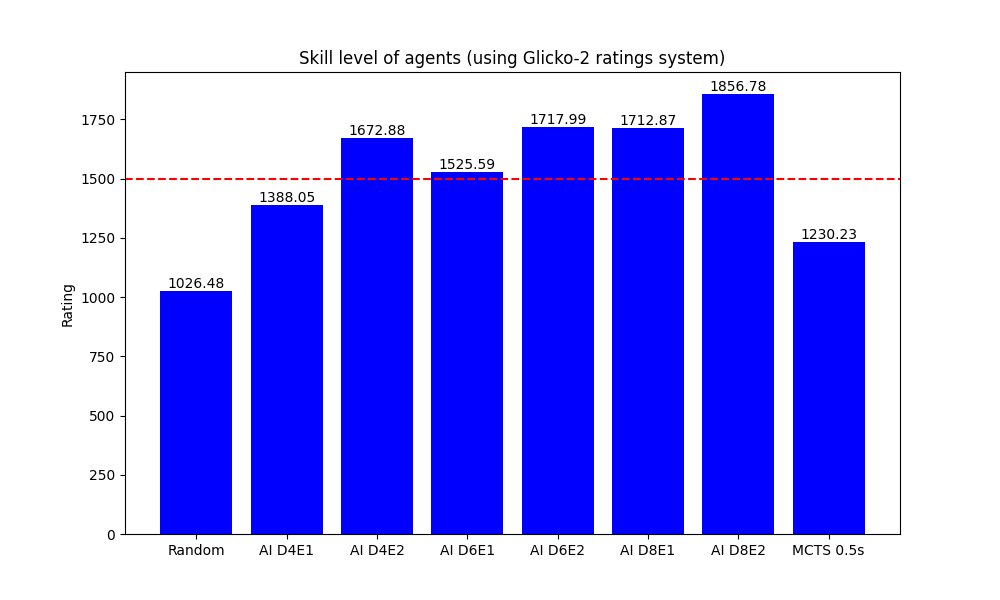
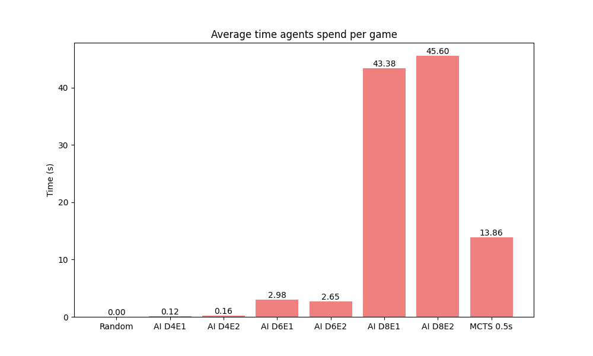

# Nine Board Tic-Tac-Toe

## Introduction

Nine Board Tic-Tac-Toe, also known as Ultimate Tic-Tac-Toe, is a board game composed of nine tic-tac-toe boards arranged in a 3×3 grid. Players take turns playing on the small tic-tac-toe boards until one of them wins on the main board. Compared to traditional tic-tac-toe, the strategy in this game is more conceptually complex and has proven more challenging for computers to master.

### Ultimate Tic-Tac-Toe Rules

1. The first move can be placed on any of the 81 empty cells.
2. Subsequent moves are restricted to the board corresponding to the position of the previous move within its local small board.
3. Once a small board is controlled (won) by a player or it is filled completely, no more moves may be played on that board; players may then choose any empty space on any available board.
4. Victory is achieved by winning three small boards in a line (row, column, or diagonal) on the main board. 


### Project Objectives

The primary objectives of this project are:

1. To implement the Nine Board Tic-Tac-Toe game logic in Python.
2. To develop and compare multiple AI agents capable of playing the game effectively, including:
   - Minimax algorithm with complete search (not implemented due to the large search space)
   - Minimax algorithm with alpha-beta pruning and depth-limited search, including evaluation functions
   - Monte Carlo Tree Search (MCTS)
3. To create a random agent as a baseline for performance comparison.
4. To conduct a comprehensive evaluation of these AI agents, analyzing their performance in terms of win rates and computational efficiency.
5. To gain insights into the strengths and weaknesses of different AI approaches in the context of Ultimate Tic-Tac-Toe.

Through this project, we aim to explore the application of classical AI techniques to complex games and gain insights into their comparative effectiveness.

## Agent Design

I chose the minimax algorithm with alpha-beta pruning, depth-limited search, and evaluation functions to implement the primary agent. The reason for not choosing minimax with complete search is that it is infeasible to implement for Ultimate Tic-Tac-Toe due to the game's complexity. The high branching factor in early moves and the vast number of possible game states make complete exploration computationally prohibitive (Wikipedia, n.d.). I also implemented the MCTS method for comparison. For baseline testing, I chose a random agent, and a human agent is also implemented for interactive play.

**Four types of agents:**
- Random agent: randomly chooses a move from the available legal moves.
- Minimax agent: uses the minimax algorithm with alpha-beta pruning.
- MCTS agent: implements Monte Carlo Tree Search.
- Human agent: allows manual input of moves through the console (not included in the evaluation).

### Heuristic Evaluation Function Rules

Two versions of the evaluation function are implemented. Although Ultimate Tic-Tac-Toe has relatively simple rules, the game lacks a straightforward heuristic evaluation function (Ultimate tic-tac-toe. n.d.). The strategies employed for the evaluation functions in this program are listed below:

1. **Small-Board Status**:
   - Completed Boards: Prioritize completed sub-boards with winning configurations. If a small-board is won, it contributes significantly to the overall score.
   - Potential Wins: Evaluate small-boards based on potential winning combinations (e.g., two symbols in a row with one empty space).

2. **Center Control**:
   - Both on the main 3×3 board and each small board, control of the center position is advantageous. The center is often a strategic point in both traditional and Nine Board Tic-Tac-Toe.

3. **Open Rows, Columns, and Diagonals**:
   - The number of open rows, columns, and diagonals that can potentially lead to a win on each small-board. 


## Implementation

### The Overall Structure of the Program

The entire program is implemented in Python 3, and the diagram shows how these components interact with each other to facilitate a game of Ultimate Tic-Tac-Toe.


### Data Structure of the Game Board

The data structure of the game board is a 9×9 2D array, where each sub-array with 9 elements represents a 3×3 small board. Each cell in the small board can be empty, 'X', or 'O'. They are represented by three integer numbers: 0, 5, and 2, respectively [Table 1]. Using integer numbers is highly efficient for calculating the game result, which is assessed by summing three cell states in a line (row, column, or diagonal). For example, for three 'X's in a row, instead of checking each cell individually for 'X', we can directly check if the sum of the row equals 15. The details are shown in [Table 2] below:

[Table 1]
| Cell State | Value |
| --- | --- |
| 'X' | 5 |
| 'O' | 2 |
| Empty | 0 |


[Table 2]
| Sum | Combination |
| --- | --- |
| 15 | Three 'X'|
| 6 | Three 'O'|
| 12 | Two 'X' and one 'O'|
| 9 | Two 'O' and one 'X'|
| 10 | Two 'X' and one empty|
| 7 | One 'O' and one 'X' and one empty|
| 2 | One 'O' and two empty|
| 5 | One 'X' and two empty|
| 0 | Three empty|

This approach is also highly efficient for evaluating the board state using evaluation functions, as the sum of three cell states in a line is unique for each combination used in the evaluation process.

### Heuristic Evaluation Function

Based on the heuristic evaluation function rules, I implemented two versions of evaluation functions for use in the minimax algorithm with alpha-beta pruning, called Evaluation Function 1 and Evaluation Function 2.

Evaluation Function 1 uses only the first rule listed above—the status of each small-board, including completed and potential winning positions, as shown in [Table 3].

[Table 3]
| Status of Cells | Small Board Score | Main Board Score |
| --- | --- | --- |
| Three 'X' | 10 | 100 |
| Three 'O' | -10 | -100 |
| Two 'X' and one empty | 5 | 50 |
| Two 'O' and one empty | -5 | -50 |

*Note: Three 'X' in a line for the main board means player X wins three small-boards in a line.*

Evaluation Function 2 incorporates the additional two rules to evaluate the board: center control and open rows, columns, and diagonals. The details are shown in [Table 4].

[Table 4]
| Status of Cells | Small Board Score | Main Board Score |
| --- | --- | --- |
| Three 'X' | 10 | 100 |
| Three 'O' | -10 | -100 |
| Two 'X' and one empty | 5 | 50 |
| Two 'O' and one empty | -5 | -50 |
| One 'X' and two empty | 2 | 20 |
| One 'O' and two empty | -2 | -20 |
| X in the center | 3 | 10 |
| O in the center | -3 | -10 |

### Minimax with Alpha-Beta Pruning

The minimax algorithm with alpha-beta pruning is implemented in the `minimax.py` file. It is combined with depth-limited search and the evaluation functions listed in the heuristic evaluation function section. Below is the pseudocode of the core part of the algorithm. Note that it uses `UNDO-ACTION` instead of copying the game board (`NineBoard`) to generate new board states.

```pseudocode
function MAX-VALUE(game_board, depth, α, β, eval_function)
    if IS-TERMINAL(game_board) or depth = 0
        return EVALUATE(game_board, eval_function)
    
    v ← -∞
    for each valid_action in GET-VALID-ACTIONS(game_board)
        new_board ← APPLY-ACTION(game_board, valid_action, X)
        v ← MAX(v, MIN-VALUE(new_board, depth - 1, α, β, eval_function))
        game_board ← UNDO-ACTION(new_board, valid_action)
        α ← MAX(α, v)
        if β ≤ α
            break  // Beta cutoff
    return v

function MIN-VALUE(game_board, depth, α, β, eval_function)
    if IS-TERMINAL(game_board) or depth = 0
        return EVALUATE(game_board, eval_function)
    
    v ← +∞
    for each valid_action in GET-VALID-ACTIONS(game_board)
        new_board ← APPLY-ACTION(game_board, valid_action, O)
        v ← MIN(v, MAX-VALUE(new_board, depth - 1, α, β, eval_function))
        game_board ← UNDO-ACTION(new_board, valid_action)
        β ← MIN(β, v)
        if β ≤ α
            break  // Alpha cutoff
    return v
```

### MCTS

The MCTS algorithm is implemented in the `mcts.py` file. Below is the pseudocode of the core part of the algorithm. It uses the UCB1 formula to select the best child node. The exploration constant `1.4` is used in the UCB1 formula.

```pseudocode
class Node
    state: GameState
    parent: Node
    children: List<Node>
    visits: Integer
    value: Float
    untried_actions: List<Action>

function MCTS-SEARCH(root_state, time_limit)
    root ← NEW Node(state = root_state)
    end_time ← CURRENT-TIME() + time_limit
    
    while CURRENT-TIME() < end_time
        node ← SELECT(root)
        if not IS-TERMINAL(node.state)
            node ← EXPAND(node)
            simulation_result ← SIMULATE(node.state)
        else
            simulation_result ← EVALUATE(node.state)
        BACKPROPAGATE(node, simulation_result)
    
    return BEST-CHILD(root)

function SELECT(node)
    while node.untried_actions is empty and node.children is not empty
        node ← BEST-UCT(node)
    return node

function EXPAND(node)
    action ← REMOVE-RANDOM(node.untried_actions)
    new_state ← APPLY-ACTION(node.state, action)
    child ← NEW Node(state = new_state, parent = node)
    node.children.ADD(child)
    return child

function SIMULATE(state)
    while not IS-TERMINAL(state)
        action ← RANDOM-POLICY(state)
        state ← APPLY-ACTION(state, action)
    return EVALUATE(state)

function BACKPROPAGATE(node, result)
    while node is not null
        node.visits ← node.visits + 1
        node.value ← node.value + result
        node ← node.parent
        result ← -result  // Negate for opponent's perspective
```


## Evaluation

### Experiment Setup

The experiment was conducted in the same environment: Apple M1 Max, 10 CPU cores, 64GB RAM. Each matchup consisted of 100 games, with each matchup switching the roles of X and O for another 100 games. The maximum depth of minimax was set to 8 and the time limit for MCTS was set to 0.5 seconds, both due to performance considerations.

The following 8 agents were evaluated:

[Table 5]
| Name | Type | Settings |
| --- | --- | --- |
| Random | Random| - |
| AI D4E1 | Minimax| Depth: 4, Evaluation: 1 |
| AI D4E2 | Minimax | Depth: 4, Evaluation: 2 |
| AI D6E1 | Minimax | Depth: 6, Evaluation: 1 |
| AI D6E2 | Minimax | Depth: 6, Evaluation: 2 |
| AI D8E1 | Minimax | Depth: 8, Evaluation: 1 |
| AI D8E2 | Minimax | Depth: 8, Evaluation: 2 |
| MCTS 0.5s | MCTS | Time limit: 0.5s |


### Results and Analysis

To compare the performance of each agent, I utilized the Glicko-2 rating system to evaluate the skill level of each agent (Glickman, 2022). This system enables easy comparison between different AI methods and strategies, clearly indicating which approaches are more effective. The initial rating is 1500, the rating deviation (RD) is 350, and the volatility is 0.06.

The win rate is calculated as the number of games won plus half the number of games drawn, divided by the total number of games played.

$$\text{win rate} = \frac{\text{wins} + 0.5 \times \text{draws}}{\text{total games}}$$

Fig. 1: Glicko-2 rating of each player


The data shown in [Fig. 1] is calculated using the Glicko-2 rating system. We can see that AI D8E2 (Minimax with depth 8 and evaluation function 2) has the highest rating at 1856.78, indicating it is the strongest agent overall. MCTS 0.5s has one of the lower ratings (1230.23) among the AI agents, outperforming only the Random agent (1026.48). There is a clear progression in strength as the depth increases for Minimax agents (D4 < D6 < D8) with the same evaluation function. Evaluation function 2 consistently outperforms evaluation function 1 at the same depth, and even significantly outperforms deeper depth Minimax AI with evaluation function 1. For example, AI D4E2 performs much better than AI D6E1 with ratings of 1678.88 and 1525.59 respectively, and AI D6E2 (1717.99) performs slightly better than AI D8E1 (1712.86). The Random agent has the lowest rating, as expected. (The red dashed line at 1500 represents the initial rating of each agent.)

Fig. 2: Average time per game of each player


From [Fig. 2], we can see that, as expected, the computation time increases exponentially with the depth of the Minimax algorithm. AI D8E2 takes the longest time per game at 45.60s, which is consistent with its high performance. MCTS 0.5s, with 13.86s per game, has a relatively consistent time per game, likely due to its fixed time limit. The Random agent has the shortest time per game, close to 0s, as it performs no complex calculations.

Fig. 3: Baseline test between other players and Random player


The win rate data for [Fig. 3] is from other agents as X against Random as O in 100 games, and then Random as X against other agents as O in 100 games. From [Fig. 3], it shows that all AI agents significantly outperform the Random agent, winning close to 100% of their games against it. The performance against the Random agent improves slightly as the Minimax depth increases, but not significantly. MCTS 0.5s also performs very well against the Random agent with a win rate of 0.88.

Fig. 4: baseline test between other players and MCTS 0.5s


The win rate data for [Fig. 4] is from other agents as X against MCTS 0.5s as O in 100 games, and then MCTS 0.5s as X against other agents as O in 100 games. From [Fig. 4], it shows that the AI agents decisively defeated MCTS 0.5s, all achieving win rates above 0.9, except AI D4E1, which was slightly lower at 0.87. The Random agent was clearly defeated by MCTS 0.5s with a win rate of only 0.12.

Fig. 5: Baseline test between other players and AI D8E2


The win rate data for [Fig. 5] is from other agents versus AI D8E2 and AI D8E2 versus other agents in 100 games respectively. From [Fig. 5], it shows that AI D8E2 dominates against all other agents with almost 100% win rates, including against MCTS 0.5s. It has the highest win rate across all matchups, confirming its top position in the Glicko-2 ratings [Fig. 1]. However, an unexpected result is that the matchup between AI D4E1 and AI D8E2 resulted in a 0.5 win rate—in fact, every game in the 100-game series ended in a draw.

These charts collectively demonstrate the effectiveness of deeper Minimax searches and the clear superiority of different evaluation functions. They also highlight the trade-off between computational time and performance, with deeper searches generally yielding better results at the cost of longer computation times.

## Discussion

Minimax with alpha-beta pruning, depth-limited search, and evaluation functions has consistently demonstrated strong performance, especially at higher depths with better evaluation functions, but at the cost of exponential increases in computation time with depth. For instance, AI D8E2 achieved the highest overall performance, demonstrating the effectiveness of deeper search combined with a more sophisticated evaluation function. However, it also had the longest computation time, which could be problematic in time-sensitive scenarios. The deeper search depth allows the agent to look further ahead in the game tree, considering more potential future states, and this capability, combined with an advanced evaluation function (Evaluation Function 2), allows AI D8E2 to outperform other agents consistently. Evaluation Function 2 consistently outperformed Evaluation Function 1 at the same depth, and even outperformed deeper-depth Minimax AI with Evaluation Function 1, showing that a more advanced evaluation function can somewhat compensate for the lack of search depth.

There are some unexpected findings: AI D4E1 managed to draw all games against AI D8E2, which is somewhat unexpected because, based on the skill rating chart, AI D8E2 should outperform AI D4E1. MCTS 0.5s was outperformed by all the Minimax implementations in this experiment, possibly due to the limited simulation time (0.5s) not allowing for sufficient exploration.

These observations highlight that Minimax with alpha-beta pruning shows strong performance but at the cost of longer computation times, while MCTS offers a different approach that could potentially be improved with more simulation time or better implementation. The results emphasize that while deeper searches generally yield better results, a superior evaluation function can significantly enhance performance, even at lower depths. The underperformance of MCTS 0.5s in this scenario also suggests that the effectiveness of different AI approaches can vary depending on the specific characteristics of the game and the implementation details.


## Conclusion

Minimax with alpha-beta pruning, depth-limited search, and evaluation functions demonstrated superior performance, especially at greater search depths and with more sophisticated evaluation functions. The quality of the evaluation function significantly impacts performance, often compensating for shallower search depths. MCTS, while effective against random players, underperformed compared to Minimax strategies in this implementation. Deeper Minimax searches generally yielded better results but at the cost of exponentially increasing computation time. Unexpected results, such as the consistent draws between AI D4E1 and AI D8E2, highlight the complex nature of strategy in Ultimate Tic-Tac-Toe.

For future work, we could develop and test more sophisticated evaluation functions that capture nuanced aspects of Ultimate Tic-Tac-Toe strategy, investigate combinations of different algorithms such as using MCTS for opening moves and Minimax for endgame scenarios, incorporate machine learning approaches such as reinforcement learning or neural networks to compare with traditional game AI methods, and conduct matches against skilled human players to benchmark AI performance against human expertise.


## References
- Glickman, M. E. (2022). Example of the Glicko-2 system. http://www.glicko.net/glicko/glicko2.pdf
- Ultimate tic-tac-toe. (n.d.). In Wikipedia. Retrieved Oct 07, 2024, from https://en.wikipedia.org/wiki/Ultimate_tic-tac-toe
- xkcd. (n.d.). https://xkcd.com/832/. Retrieved from https://xkcd.com/832/


## Appendix A: Game Results

1. The result data in the `data` directory is stored in the `results_competition_a1.csv` file for the standard game and `results_competition_a1_lite.csv` for the lite version.

2. The content of these files is presented in the table format, where every cell presents the format `((number of games X wins, number of games O wins), average time X took, average time O took)`. For example, `((100, 0), 1.925400972366333, 15.00204849243164)` means X wins all the games, with an average time of 1.925400972366333 seconds for X and 15.00204849243164 seconds for O.

