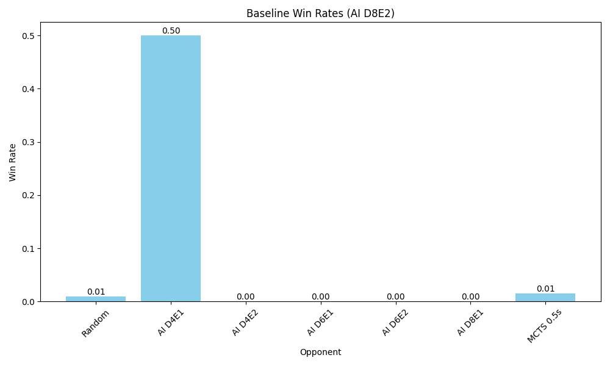

# Introduction

Nine Board Tic-Tac-Toe, also known as Ultimate Tic-Tac-Toe, is a board game composed of nine tic-tac-toe boards arranged in a 3×3 grid. Players take turns playing on the small tic-tac-toe boards until one of them wins on the main board. Compared to traditional tic-tac-toe (xkcd. n.d.), strategy in this game is conceptually more difficult and has proven more challenging for computers.

## Ultimate Tic-Tac-Toe Rules

1. The first move can be placed on any of the 81 empty cells.
2. Subsequent moves are restricted to the board corresponding to the position of the previous move within its local small board.
3. Once a small board is controlled(won) by a player or it is filled completely, no more moves may be played in that board, they may choose any empty space on any available board.
4. Victory is achieved by winning three small boards in a line (row, column, or diagonal) on the main board. (P.S: different from the assignment description, in the assignment, any board is a win.)


## Project Objectives

The primary objectives of this project are:

1. To implement the Nine Board Tic-Tac-Toe game logic in Python.
2. To develop and compare multiple AI agents capable of playing the game effectively, including:
   - Minimax algorithm with complete search (not implemented due to the large search space)
   - Minimax algorithm with alpha-beta pruning and depth-limited search including evaluation functions ~~comparing among different depths, two different evaluation strategies~~
   - Monte Carlo Tree Search (MCTS)
3. To create a random player as a baseline for performance comparison.
4. To conduct a comprehensive evaluation of these AI agents, analyzing their performance in terms of win rates and computational efficiency.
5. To gain insights into the strengths and weaknesses of different AI approaches in the context of Ultimate Tic-Tac-Toe.

Through this project, we aim to explore the application of classical AI techniques to a complex game.


2. **Agent Design:**
 I choose minimax algorithm with alpha-beta pruning, depth-limited search and evaluation function to implement the agent. The reason for not choose minimax with complete search is that it is infeasible to implement for Ultimate Tic-Tac-Toe due to the game's complexity, expecially the branching factor in the early moves, which is too high, and the number of possible game states is too large to explore [TODO: reference to the calculation of the complexity]. And I also choose MCTS method for comparison. For baseline test, I choose random player. A human player is also implemented just for fun.
  

Four kinds of player:
- Random player: randomly choose a move from the possible moves.
- Minimax player: minimax algorithm with alpha-beta pruning.
- MCTS player: Monte Carlo Tree Search.
- Human player: input the move in the console. (not included in the evaluation)


### Heuristic Evaluation Function:
Two versions of the evaluation function have been implemented. Notwithstanding the relatively simple rules of Ultimate Tic-Tac-Toe, the game lacks a straightforward heuristic evaluation function (Ultimate tic-tac-toe. n.d.). The strategy employed for the evaluation functions in this program is outlined below:

1. **Small-Board Status**:
   - **Completed Boards**: Prioritize completed sub-boards with a winning configuration. If a small-board is won, it contributes significantly to the overall score.
   - **Potential Wins**: Evaluate small-boards based on potential winning combinations (e.g., two of your symbols in a row with an empty space).

2. **Center Control**:
   - Both on the main 3x3 board and each small-board, control of the center is advantageous. The center is often a strategic point in both traditional and Nine Board Tic-Tac-Toe.

3. **Open Rows, Columns, and Diagonals**:
   - The number of open rows, columns, and diagonals that can potentially lead to a win on each small-board. 


## Implementation:
### The whole structure of the program
The diagram shows how these components interact with each other to facilitate a game of Ultimate Tic Tac Toe.


### Data Structure of the Game Board : 
The data structure of the game board is a 9x9 2D array, each sub-array with 9 elements represent a 3x3 small board. Each cell in the small board can be empty, 'X', or 'O'. They are represented by three integer numbers 0, 5, 2 respectively. Because using integer number is super efficient to calculate the game result which is assessed by three cell states in a line(row, column or diagonal). For example, for three 'X's in a row, instead of checking each cell equal to 'X', we can directly check the sum of the row is 15. The detail is shown in the table below:

[table 1]
| Cell State | Value |
| --- | --- |
| X | 5 |
| O | 2 |
| Empty | 0 |


[table 2]
| Sum | Combination |
| --- | --- |
| 15 | three 'X'|
| 6 | three 'O'|
| 12 | two 'X' and one 'O'|
| 9 | two 'O' and one 'X'|
| 10 | two 'X' and one empty|
| 7 | one 'O' and one 'X' and one empty|
| 2 | one 'O' and two empty|
| 5 | one 'X' and two empty|
| 0 | three empty|

It's aslo very efficient to evaluate the value of evaluation functions, because the sum of three cell states in line is unique for each combination used in the evaluation functions.

#### Heuristic Evaluation Function
Based on the evaluation rules, I set two versions of evaluation function.
The first version uses only the first rule the status of each small-board, completed and potential winning.

[table 3]
| Status of Cells | Small Board Score | Main Board Score |
| --- | --- | --- |
| Three 'X' | 10 | 100 |
| Three 'O' | -10 | -100 |
| Two 'X' and one empty | 5 | 50 |
| Two 'O' and one empty | -5 | -50 |

Three 'X' in a line for the main board means player X wins three small-boards in a line.

The second version uses more other two rules to evaluate the board. Center control and Open rows, columns, and diagonals.
The detail of the implementation is in the code snippet.

[table 4]
| Status of Cells | Small Board Score | Main Board Score |
| --- | --- | --- |
| Three 'X' | 10 | 100 |
| Three 'O' | -10 | -100 |
| Two 'X' and one empty | 5 | 50 |
| Two 'O' and one empty | -5 | -50 |
| One 'X' and two empty | 2 | 20 |
| One 'O' and two empty | -2 | -20 |
| X in the center | 3 | 10 |
| O in the center | -3 | -10 |

#### Multi-processing
using the `multiprocessing` library to run multiple games in parallel, when evaluating the performance of the agents, because each pair of agents need to play 100 games, if not using multi-processing, it will take too long to run. It will use 10 processes to run the games in parallel, due to the Apple M1 Max, 10 CPU cores.

#### Minimax with alpha-beta pruning
The minimax algorithm with alpha-beta pruning is implemented in the `minimax.py` file.
It also combined with depth-limited search and evaluation function listed in the evaluation function section.
The below is the pseudocode of the core part of the algorithm. You can find it used `UNDO-ACTION` instead of copying the game board to generate new board.

```pseudocode
function MAX-VALUE(game_board, depth, α, β, eval_function)
    if IS-TERMINAL(game_board) or depth = 0
        return EVALUATE(game_board, eval_function)
    
    v ← -∞
    for each valid_action in GET-VALID-ACTIONS(game_board)
        new_board ← APPLY-ACTION(game_board, valid_action, X)
        v ← MAX(v, MIN-VALUE(new_board, depth - 1, α, β, eval_function))
        game_board ← UNDO-ACTION(new_board, valid_action)
        α ← MAX(α, v)
        if β ≤ α
            break  // Beta cutoff
    return v

function MIN-VALUE(game_board, depth, α, β, eval_function)
    if IS-TERMINAL(game_board) or depth = 0
        return EVALUATE(game_board, eval_function)
    
    v ← +∞
    for each valid_action in GET-VALID-ACTIONS(game_board)
        new_board ← APPLY-ACTION(game_board, valid_action, O)
        v ← MIN(v, MAX-VALUE(new_board, depth - 1, α, β, eval_function))
        game_board ← UNDO-ACTION(new_board, valid_action)
        β ← MIN(β, v)
        if β ≤ α
            break  // Alpha cutoff
    return v
```

#### MCTS

The MCTS algorithm is implemented in the `mcts.py` file. The below is the pseudocode of the core part of the algorithm. It uses UCB1 formula to select the best child node. The exploration constant `1.4` is used in the UCB1 formula.

```pseudocode
class Node
    state: GameState
    parent: Node
    children: List<Node>
    visits: Integer
    value: Float
    untried_actions: List<Action>

function MCTS-SEARCH(root_state, time_limit)
    root ← NEW Node(state = root_state)
    end_time ← CURRENT-TIME() + time_limit
    
    while CURRENT-TIME() < end_time
        node ← SELECT(root)
        if not IS-TERMINAL(node.state)
            node ← EXPAND(node)
            simulation_result ← SIMULATE(node.state)
        else
            simulation_result ← EVALUATE(node.state)
        BACKPROPAGATE(node, simulation_result)
    
    return BEST-CHILD(root)

function SELECT(node)
    while node.untried_actions is empty and node.children is not empty
        node ← BEST-UCT(node)
    return node

function EXPAND(node)
    action ← REMOVE-RANDOM(node.untried_actions)
    new_state ← APPLY-ACTION(node.state, action)
    child ← NEW Node(state = new_state, parent = node)
    node.children.ADD(child)
    return child

function SIMULATE(state)
    while not IS-TERMINAL(state)
        action ← RANDOM-POLICY(state)
        state ← APPLY-ACTION(state, action)
    return EVALUATE(state)

function BACKPROPAGATE(node, result)
    while node is not null
        node.visits ← node.visits + 1
        node.value ← node.value + result
        node ← node.parent
        result ← -result  // Negate for opponent's perspective
```


## Evaluation

The experiment is conducted in the same environment, Apple M1 Max, 10 CPU cores, 64GB RAM. 100 games for each pair of matchups, each matchup will switch the role of X and O and play another 100 games. The max depth of minimax is 8, the time limit for MCTS is 0.5 second, due to the performance.

There are 8 players listed below will be evaluated:

| Name | Type | Settings | Info |
| --- | --- | --- | --- |
| Random | Random player | - | - |
| AI D4E1 | Minimax | Depth: 4, Evaluation: 1 | - |
| AI D4E2 | Minimax | Depth: 4, Evaluation: 2 | - |
| AI D6E1 | Minimax | Depth: 6, Evaluation: 1 | - |
| AI D6E2 | Minimax | Depth: 6, Evaluation: 2 | - |
| AI D8E1 | Minimax | Depth: 8, Evaluation: 1 | - |
| AI D8E2 | Minimax | Depth: 8, Evaluation: 2 | - |
| MCTS 0.5s | MCTS | Time limit: 0.5s | - |


# Results and Analysis
Glicko-2 rating of each player is shown below:
For comparing the performance of each player, I use the Glicko-2 rating system to evaluate the skill of each player (Glickman, 2022). It allows for easy comparison between different AI strategies, clearly showing which approaches are more effective.

The win rate is calculated by the number of games won plus half the number of games drawn divided by the number of games played.

```
win_rate = (wins + 0.5 * draws) / total_games
```

From [chart 1], we can see that AI D8E2 (Minimax with depth 8 and evaluation function 2) has the highest rating, indicating it's the strongest player overall. MCTS 0.5s has one of the lower ratings among the AI players, only outperforming the Random player. There's a clear progression in strength as the depth increases for Minimax players (D4 < D6 < D8) in the same evaluation function. Evaluation function 2 consistently outperforms evaluation function 1 for the same depth. The Random player has the lowest rating, as expected. 1500 is the initial rating of each player.

From [chart 2], we can see that as expected, the computation time increases exponentially with the depth of the Minimax algorithm. AI D8E2 takes the longest time per game, which is consistent with its high performance.  MCTS 0.5s has a consistent time per game, likely due to its fixed time limit. The Random player has the shortest time per game, as it doesn't perform any complex calculations.

The win rate data from others players as X agianst Random as O in 100 games, which in turn Random as X against others players as O in 100 games. From [chart 3], it shows that all AI players significantly outperform the Random player, winning close to 100% of their games against it. The performance against the Random player improves slightly as the Minimax depth increases but not significantly. MCTS 0.5s also performs very well against the Random player.

The win rate data from others players as X agianst MCTS 0.5s as O in 100 games, which in turn MCTS 0.5s as X against others players as O in 100 games. From [chart 4] it shows that the AI players completely defeated MCTS 0.5s all above 90% in the win rate data, except AI D4E1 at 82%. Random player is defeated by MCTS 0.5s clearly.

The win rate data is from other players vs AI D8E2 and AI D8E2 vs others players in 100 games respectively. From [chart 5], it shows that AI D8E2 dominates against all other players, including MCTS 0.5s. It has the highest win rate across all matchups, confirming its top position in the Glicko-2 ratings. It also shows an unexpected result that the matchup between AI D4E1 and AI D8E2 is 50% rate, actually it was 100 draws in the 100 games, AI D8E2 has deeper search depth and more advance evaluation function, but did not win D4E1 even once.

These charts collectively demonstrate the effectiveness of deeper Minimax searches and the clear effectiveness of different evaluation function. They also highlight the trade-off between computational time and performance, with deeper searches generally yielding better results at the cost of longer computation times.

Chart 1: Glicko-2 rating of each player


Chart 2: Average time per game of each player


Chart 3: Baseline test between other players and Random player


Chart 4: baseline test between other players and MCTS 0.5s


Chart 5: Baseline test between other players and AI D8E2



## Strategic Insights
Based on the results and analysis you've provided, I can outline the strengths and weaknesses of each approach:

1. Minimax with Alpha-Beta Pruning:

Strengths:
- Consistently strong performance, especially at higher depths
- Improved performance with better evaluation functions
- Deterministic and reliable decision-making

Weaknesses:
- Exponential increase in computation time with depth
- Performance heavily dependent on the quality of the evaluation function
- May struggle in very complex game states due to depth limitations

2. Monte Carlo Tree Search (MCTS):

Strengths:
- Can handle large search spaces
- Does not require a sophisticated evaluation function
- Can provide good results with limited time

Weaknesses:
- Underperformed compared to Minimax in this implementation
- Performance may be inconsistent due to its probabilistic nature
- Effectiveness can depend on the number of simulations, which is limited by time constraints

3. Random Player:

Strengths:
- Very fast decision-making
- Useful as a baseline for comparison

Weaknesses:
- Poor performance overall
- No strategic decision-making

Specific observations:

1. Minimax (AI D8E2):
Strength: Highest overall performance, demonstrating the effectiveness of deeper search and a more sophisticated evaluation function.
Weakness: Longest computation time, which could be problematic in time-sensitive scenarios.

2. Minimax (AI D4E1):
Strength: Surprisingly effective against higher-depth Minimax (drew all games against AI D8E2).
Weakness: Generally lower performance compared to deeper searches or more advanced evaluation functions.

3. MCTS 0.5s:
Strength: Consistent time per game due to fixed time limit.
Weakness: Underperformed compared to Minimax strategies, possibly due to limited simulation time.

4. Evaluation Function 2:
Strength: Consistently outperformed Evaluation Function 1 at the same depth, showing the importance of a good evaluation function.
Weakness: The improvement may not be as significant at lower depths.

These observations highlight the trade-offs between computational complexity and performance in game AI strategies. Minimax with alpha-beta pruning shows strong performance but at the cost of longer computation times, while MCTS offers a different approach that could potentially be improved with more simulation time or better implementation. The results also emphasize the critical role of both search depth and evaluation function quality in Minimax performance.

# Discussion

## Interpretation of Results
- Analysis of why certain agents performed better in specific scenarios
- Unexpected findings or interesting patterns
Minimax with deeper search depths (e.g., AI D8E2):
Better overall performance: The deeper search depth allows the agent to look further ahead in the game tree, considering more potential future states. This enables it to make more strategic decisions that account for long-term consequences.
Dominance against other players: The combination of deep search and an advanced evaluation function (E2) allows AI D8E2 to outperform other agents consistently. It can anticipate and counter opponents' strategies more effectively.

Evaluation Function Comparison (E1 vs E2):
Consistent improvement: Across all depths, the more advanced evaluation function (E2) outperformed the basic one (E1), highlighting the importance of a well-designed evaluation function in Minimax algorithms.
Diminishing returns at higher depths: The improvement from E1 to E2 seems less pronounced at higher depths, suggesting that deeper searches can somewhat compensate for a less sophisticated evaluation function.


Unexpected Results:
Underperformance against Minimax: MCTS was outperformed by most Minimax implementations, possibly due to the limited simulation time (0.5s) not allowing for sufficient exploration of the game tree in this complex game.

Surprisingly, AI D4E1 managed to draw all games against AI D8E2

The results emphasize that while deeper searches generally yield better results, a well-designed evaluation function can significantly enhance performance, even at lower depths. The underperformance of MCTS in this scenario also suggests that the effectiveness of different AI approaches can vary depending on the specific characteristics of the game and the implementation details.

## Limitations of the Study
- Any constraints that might have affected the results
Evaluation function design:
The performance of Minimax heavily depends on the quality of the evaluation function. For Ultimate Tic-Tac-Toe, there's no simple and effective evaluation function that can evaluate the board state accurately. The evaluation functions listed in the report might be not good enough to estimate the board state.

Deterministic nature of Minimax:
The deterministic nature of Minimax might have led to repeated game patterns, especially in matchups between Minimax agents. This could explain phenomena like the 100 draws between AI D4E1 and AI D8E2.

MCTS implementation:
The specific implementation details of MCTS (e.g., exploration constant, rollout policy) can significantly affect its performance. Different tuning might lead to better results.

- Potential areas for improvement in the experimental design
Hybrid approaches: Explore combinations of different algorithms, such as using MCTS for opening moves and Minimax for endgame scenarios

More evaluation rules, like,
Opponent Threats: Assess the number of immediate threats (e.g., the opponent has two in a row and can win next turn) and prioritize blocking these threats.

Strategic Control: Control of crucial sub-boards that affect future move directions, especially the center and corners of the main grid.

Time-based performance metrics:
Introduce time controls and evaluate performance under different time constraints.

Human expert evaluation:
Include games against human experts to benchmark AI performance against skilled human players.

Move ordering:
Implement move ordering heuristics to improve alpha-beta pruning efficiency.


# Conclusion

## Summary of Key Findings

This study on AI strategies for Ultimate Tic-Tac-Toe has yielded several important insights:

1. Minimax with alpha-beta pruning demonstrated superior performance, especially at greater search depths and with more sophisticated evaluation functions.
2. The quality of the evaluation function significantly impacts performance, often compensating for shallower search depths.
3. MCTS, while effective against random players, underperformed compared to Minimax strategies in this implementation.
4. Deeper Minimax searches generally yielded better results but at the cost of exponentially increasing computation time.
5. Unexpected results, such as the consistent draws between AI D4E1 and AI D8E2, highlight the complex nature of strategy in Ultimate Tic-Tac-Toe.

## Implications for AI in Complex Game Environments

These findings have several implications for AI in complex game environments:

1. Trade-offs between search depth, evaluation function sophistication, and computation time are crucial considerations in designing effective game AI.
2. The effectiveness of different AI approaches can vary significantly depending on the specific characteristics of the game and implementation details.
3. In complex games like Ultimate Tic-Tac-Toe, a well-designed evaluation function can be as important as search depth in determining AI performance.
4. The challenge of balancing exploration and exploitation, as seen in the MCTS results, remains a key issue in game AI design.

## Potential Future Work and Improvements

Based on our findings and the limitations of the current study, several areas for future work and improvement emerge:

1. Evaluation Function Refinement: Develop and test more sophisticated evaluation functions that capture nuanced aspects of Ultimate Tic-Tac-Toe strategy.

3. Hybrid Approaches: Investigate combinations of different algorithms, such as using MCTS for opening moves and Minimax for endgame scenarios.

4. Advanced AI Techniques: Incorporate machine learning approaches, such as reinforcement learning or neural networks, to compare with traditional game AI methods.

5. Human Expert Comparison: Conduct matches against skilled human players to benchmark AI performance against human expertise.

By pursuing these avenues of research, we can further our understanding of AI strategies in complex game environments and potentially develop more robust and adaptable game AI systems.

## References
- Glickman, M. E. (2022). Example of the Glicko-2 system. http://www.glicko.net/glicko/glicko2.pdf
- Ultimate tic-tac-toe. (n.d.). In Wikipedia. Retrieved Oct 07, 2024, from https://en.wikipedia.org/wiki/Ultimate_tic-tac-toe

- xkcd. (n.d.). https://xkcd.com/832/. Retrieved from https://xkcd.com/832/


## Appendix A: Code Snippets
TODO: code snippets

## Appendix B: Instruction to run the code
An instruction on how to use this Ultimate Tic Tac Toe program:

Before running the code, make sure you have installed the following packages:
```
pip3 install pandas
pip3 install glicko2
```

To run the program, you need to use the command line and provide specific arguments. The program offers three different modes of play: human vs AI, AI vs AI, and a competition mode. Here's how to use each mode:

1. Human vs AI mode:
   ```
   python3 main.py -m human [-l]
   ```
   - The `-m human` argument sets the mode to human vs AI.
   - The optional `-l` flag enables the "lite" version of the game.
   - After running this command, you'll be prompted to choose an AI opponent from a list.

2. AI vs AI mode:
   ```
   python3 main.py -m AI [-l]
   ```
   - The `-m AI` argument sets the mode to AI vs AI.
   - The optional `-l` flag enables the "lite" version of the game.
   - After running this command, you'll be prompted to choose two AI players to compete against each other.

3. Competition mode:
   ```
   python3 main.py -m competition [-l] [-t TURNS]
   ```
   - The `-m competition` argument sets the mode to competition.
   - The optional `-l` flag enables the "lite" version of the game.
   - The optional `-t TURNS` argument allows you to specify the number of turns for each matchup (default is 100).
   - This mode will run multiple games between different AI players and output the results.

Additional notes:
- The "lite" version (`-l` flag) changes the winning condition to any board in the nine boards, rather than the standard Ultimate Tic Tac Toe rules.
- In human vs AI mode, you'll play as the X player, and the AI will be the O player.
- The program uses various AI strategies, including Random, MiniMax with different depths and evaluation functions, and Monte Carlo Tree Search (MCTS) with different time limits.

Remember to run this script from the directory containing all the necessary Python files (game_board.py, minimax.py, mcts.py, evaluation.py, random_player.py, and human.py).


## Appendix C: Game Results
1. The result data is stored in the `results_compeition_a1.csv` file for standard game and `results_compeition_a1_lite.csv` for lite version.
2. The content of these files is presented in the table, every cell presents the format `((the number of games X wins, the number of games O wins), average time of X took, average time of O took)`, for example, `((100, 0), 1.925400972366333, 15.00204849243164)` means X wins all the games, and the average time of X took is 1.925400972366333 seconds, and the average time of O took is 15.00204849243164 seconds.

### others ####
For depth 6, the performance of minimax with alpha-beta pruning is way better than without, nearly 40 times faster.